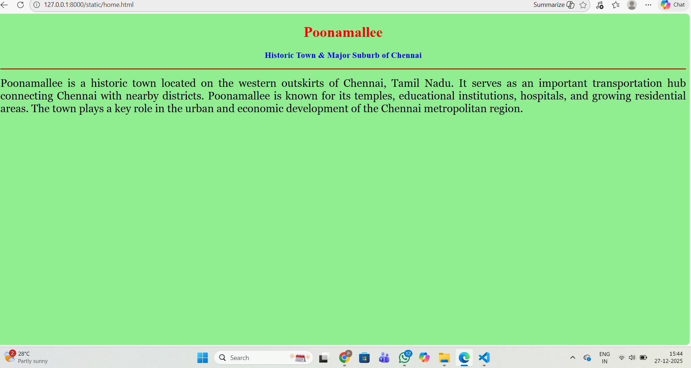
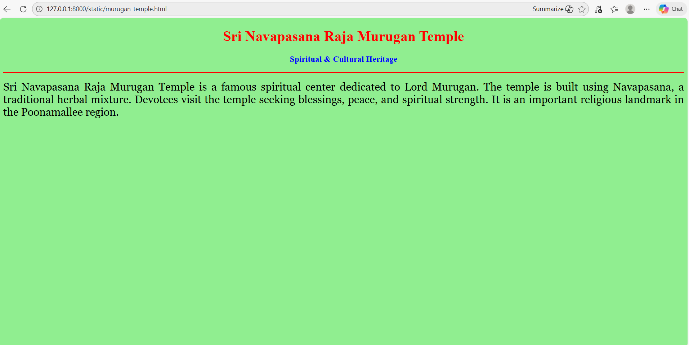
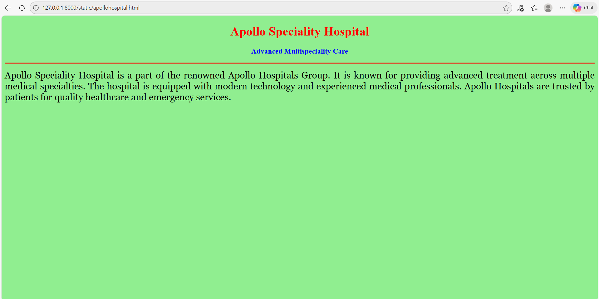
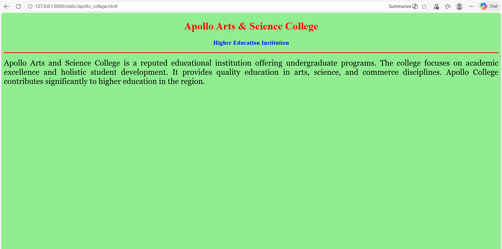
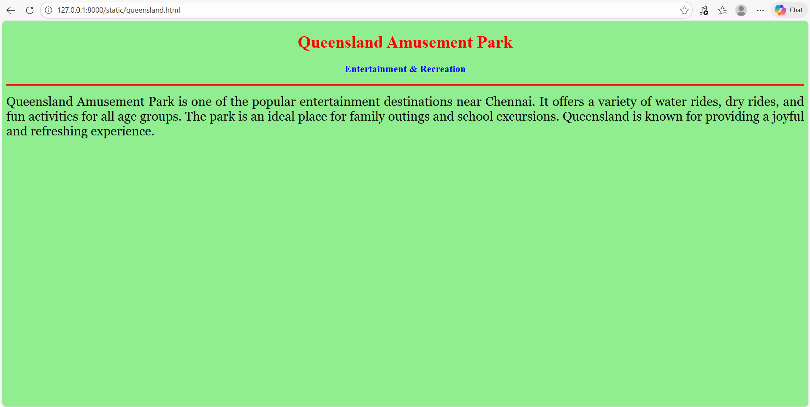

# Ex04 Places Around Me
# Date: 24.11.2025
# AIM
To develop a website to display details about the places around my house.

# DESIGN STEPS
## STEP 1
Create a Django admin interface.

## STEP 2
Download your city map from Google.

## STEP 3
Using <map> tag name the map.

## STEP 4
Create clickable regions in the image using <area> tag.

## STEP 5
Write HTML programs for all the regions identified.

## STEP 6
Execute the programs and publish them.

# CODE
map.html

<html>
    <head>
        <title> My City</title>
        </head>
        <body> 
            <h1 align="center">
                <b>chennai</b>
            </h1>
            <h3 align="center">
                <b>Paravezhaa M (25019097)</b>
            </h3>
            

                
                <map name="My City">
                    <area shape="rect" coords="100,100,900,900" href="home.html" title="My Home Town"
                    <map name="MyCity">

    <area shape="rect"
          coords="720,260,880,420"
          href="home.html"
          title="Poonamallee">

    <area shape="circle"
          coords="560,300,45"
          href="panimalar.html"
          title="Panimalar Medical College Hospital">

    <area shape="circle"
          coords="1180,300,40"
          href="apollohospital.html"
          title="Apollo Speciality Hospital">

    <area shape="circle"
          coords="1000,420,35"
          href="murugan_temple.html"
          title="Sri Navapasana Raja Murugan Temple">

    <area shape="circle"
          coords="420,420,40"
          href="queensland.html"
          title="Queensland Amusement Park">

    <area shape="rect"
          coords="300,360,420,420"
          href="apollo_college.html"
          title="Apollo Arts and Science College">

                </map>
                

            </body>
            </html>

home.html

<!DOCTYPE html>
<html>
<head>
    <title>Poonamallee</title>
</head>
<body bgcolor="lightgreen">

    <h1 align="center">
        <b>Poonamallee</b>
    </h1>

    <h3 align="center">
        <b>Historic Town & Major Suburb of Chennai</b>
    </h3>

    

    

        
        Poonamallee is a historic town located on the western outskirts of Chennai, Tamil Nadu.
        It serves as an important transportation hub connecting Chennai with nearby districts.
        Poonamallee is known for its temples, educational institutions, hospitals, and growing residential areas.
        The town plays a key role in the urban and economic development of the Chennai metropolitan region.
        
    

</body>
</html>

apollohospital.html

<!DOCTYPE html>
<html>
<head>
    <title>Apollo Hospital</title>
</head>
<body bgcolor="lightgreen">

    <h1 align="center">
        <b>Apollo Speciality Hospital</b>
    </h1>

    <h3 align="center">
        <b>Advanced Multispeciality Care</b>
    </h3>

    

    

        
        Apollo Speciality Hospital is a part of the renowned Apollo Hospitals Group.
        It is known for providing advanced treatment across multiple medical specialties.
        The hospital is equipped with modern technology and experienced medical professionals.
        Apollo Hospitals are trusted by patients for quality healthcare and emergency services.
        
    

</body>
</html>

panimalar.html

<!DOCTYPE html>
<html>
<head>
    <title>Panimalar Hospital</title>
</head>
<body bgcolor="lightgreen">

    <h1 align="center">
        <b>Panimalar Medical College Hospital</b>
    </h1>

    <h3 align="center">
        <b>Healthcare & Medical Education</b>
    </h3>

    

    

        
        Panimalar Medical College Hospital is a well-known healthcare institution located near Poonamallee, Chennai.
        The hospital provides quality medical care along with advanced diagnostic facilities.
        It also serves as a teaching hospital, offering practical medical training to students.
        Panimalar Hospital plays an important role in serving the surrounding suburban and rural population.
        
    

</body>
</html>

queensland.html

<!DOCTYPE html>
<html>
<head>
    <title>Queensland</title>
</head>
<body bgcolor="lightgreen">

    <h1 align="center">
        <b>Queensland Amusement Park</b>
    </h1>

    <h3 align="center">
        <b>Entertainment & Recreation</b>
    </h3>

    

    

        
        Queensland Amusement Park is one of the popular entertainment destinations near Chennai.
        It offers a variety of water rides, dry rides, and fun activities for all age groups.
        The park is an ideal place for family outings and school excursions.
        Queensland is known for providing a joyful and refreshing experience.
        
    

</body>
</html>

murugan_temple.html

<!DOCTYPE html>
<html>
<head>
    <title>Murugan Temple</title>
</head>
<body bgcolor="lightgreen">

    <h1 align="center">
        <b>Sri Navapasana Raja Murugan Temple</b>
    </h1>

    <h3 align="center">
        <b>Spiritual & Cultural Heritage</b>
    </h3>

    

    

        
        Sri Navapasana Raja Murugan Temple is a famous spiritual center dedicated to Lord Murugan.
        The temple is built using Navapasana, a traditional herbal mixture.
        Devotees visit the temple seeking blessings, peace, and spiritual strength.
        It is an important religious landmark in the Poonamallee region.
        
    

</body>
</html>

apollo_college.html

<!DOCTYPE html>
<html>
<head>
    <title>Apollo Arts and Science College</title>
</head>
<body bgcolor="lightgreen">

    <h1 align="center">
        <b>Apollo Arts & Science College</b>
    </h1>

    <h3 align="center">
        <b>Higher Education Institution</b>
    </h3>

    

    

        
        Apollo Arts and Science College is a reputed educational institution offering undergraduate programs.
        The college focuses on academic excellence and holistic student development.
        It provides quality education in arts, science, and commerce disciplines.
        Apollo College contributes significantly to higher education in the region.
        
    

</body>
</html>

# OUTPUT

# RESULT
The program for implementing image maps using HTML is executed successfully.
